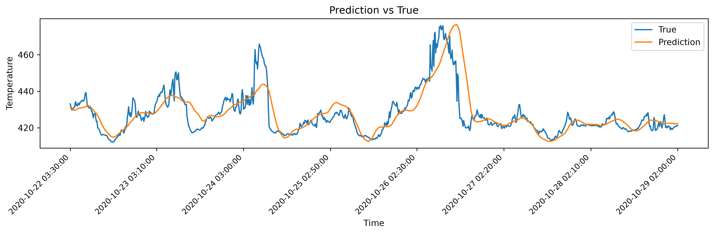
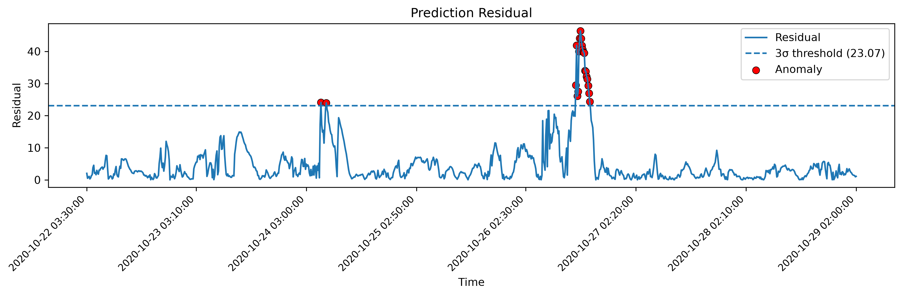
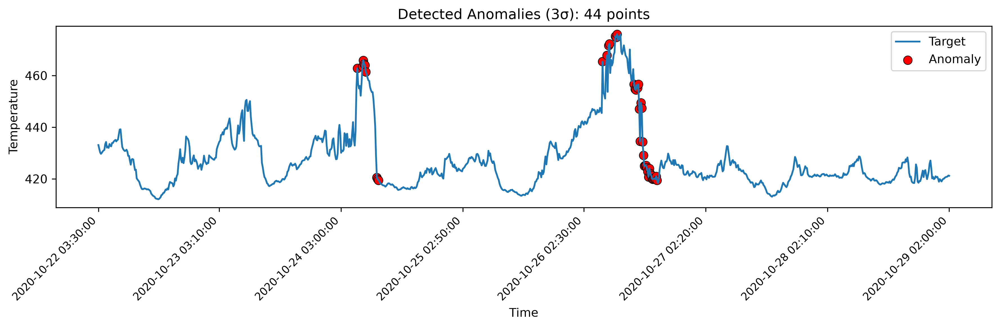

# Multivariate Time Series Forecasting and Anomaly Detection Platform


## Overview

A deep learning based platform for multivariate time series forecasting
and anomaly detection.

This project provides a complete pipeline including model training,
prediction, evaluation, residual analysis, anomaly detection and
visualization.

Supported models:

-   LSTM
-   Transformer
-   iTransformer

## Features

### Multivariate Time Series Forecasting

The platform supports:

  Model          Description
  -------------- ---------------------------------------------------
  LSTM           Recurrent neural network baseline
  Transformer    Attention-based forecasting model
  iTransformer   Inverted Transformer for multivariate forecasting

### Model Evaluation

Metrics:

-   R²
-   RMSE
-   MAE
-   MAPE

### Residual-based Anomaly Detection

Residual definition:

    Residual = |y - y_pred|

Implemented methods:

-   3σ statistical threshold
-   IQR rule
-   Isolation Forest

### Visualization

Generated results:

-   Prediction vs True curve
-   Residual curve with threshold
-   Anomaly detection visualization

## Project Structure

    time-series-anomaly-platform

    ├── configs
    ├── datasets
    ├── models
    ├── trainers
    ├── inference
    ├── evaluation
    ├── anomaly
    ├── visualization
    ├── train.py
    ├── predict.py
    ├── postprocess.py
    ├── detect_anomaly.py
    ├── requirements.txt
    └── README.md

## Experiment Results

Dataset:

-   Weather

  Model                R²    RMSE     MAE
  -------------- -------- ------- -------
  LSTM             0.9513   73.27   24.20
  Transformer      0.9803   46.59   15.57
  iTransformer     0.9876   37.00    9.73

The iTransformer achieved the best forecasting performance.
---

## Visualization


### Forecasting Performance


The forecasting results of iTransformer are compared with the ground truth.





### Residual Analysis


Prediction residuals are analyzed to identify abnormal time points.





### Anomaly Detection


Abnormal timestamps are detected based on residual thresholds.




---

## Pipeline

    Dataset
       |
    Data preprocessing
       |
    Forecasting Models
    (LSTM / Transformer / iTransformer)
       |
    Prediction
       |
    Residual Calculation
       |
    Anomaly Detection
       |
    Visualization

## Quick Start

Install dependencies:

``` bash
pip install -r requirements.txt
```

Train:

``` bash
python train.py --config configs/weather.yaml
```

Prediction:

``` bash
python predict.py
```

Evaluation:

``` bash
python -m evaluation.evaluate
```

Anomaly detection:

``` bash
python detect_anomaly.py
```

Visualization:

``` bash
python -m visualization.plot_results
```

## Environment

-   Python 3.10+
-   PyTorch 2.x
-   CUDA supported GPU

## Dataset

Required files:

    data/processed/Weather/

    ├── train.csv
    ├── val.csv
    ├── test.csv
    └── scaler.joblib

## License

MIT License
