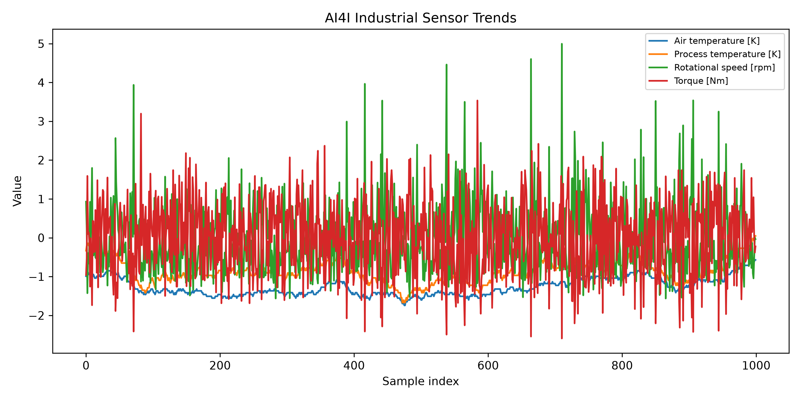
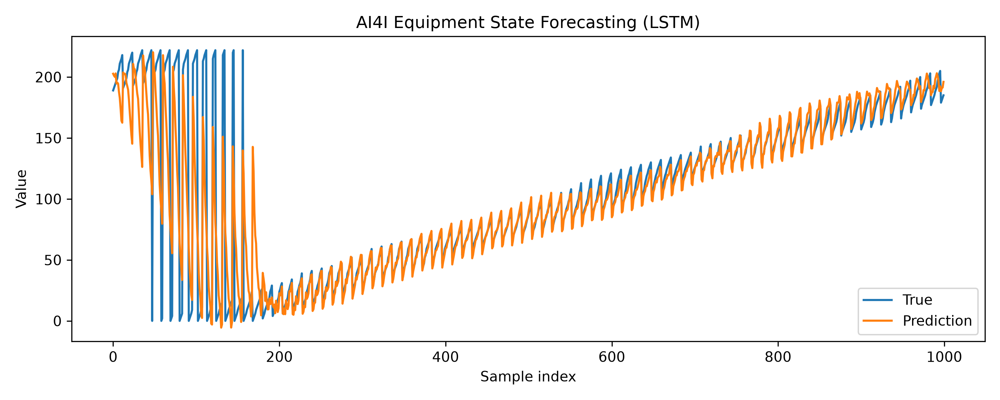
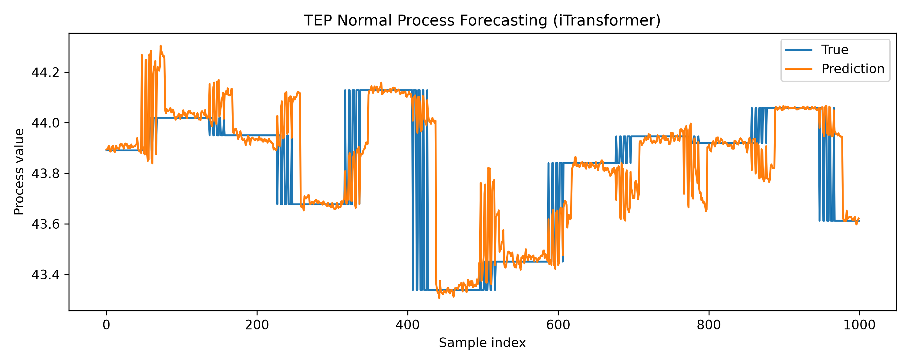
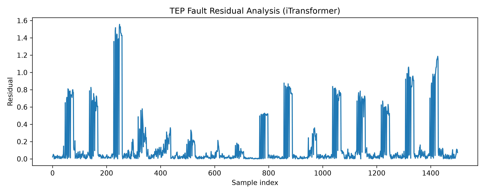
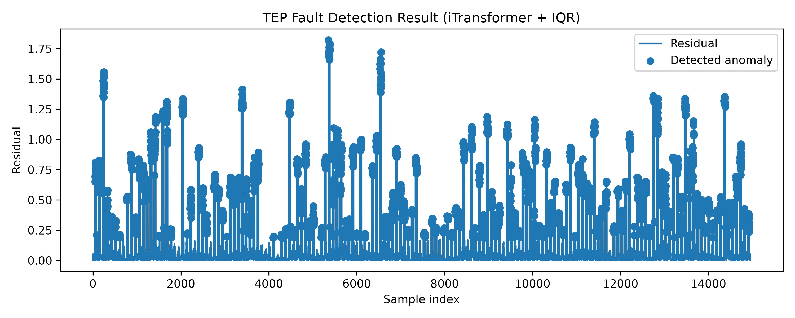

# Multivariate Time Series Forecasting and Anomaly Detection Platform

A deep learning framework for multivariate time series forecasting and
industrial anomaly analysis.

## Project Overview

This project develops a deep learning based framework for multivariate
time series forecasting and anomaly detection.

The framework integrates:

-   Data preprocessing
-   Deep learning model training
-   Forecasting evaluation
-   Residual analysis
-   Anomaly detection

Besides benchmark time series datasets, industrial monitoring scenarios
are investigated using equipment predictive maintenance and industrial
process monitoring datasets.

------------------------------------------------------------------------

# Features

-   Unified multivariate time series forecasting framework
-   Multiple deep learning models:
    -   LSTM
    -   Transformer
    -   iTransformer
-   Forecasting evaluation:
    -   R²
    -   RMSE
    -   MAE
-   Residual-based anomaly detection:
    -   3-Sigma
    -   IQR
    -   Isolation Forest
-   Industrial monitoring case studies

------------------------------------------------------------------------

# Project Structure

``` text
time-series-anomaly-platform

├── configs
├── data
├── datasets
├── models
├── trainers
├── preprocessing
├── evaluation
├── visualization
├── anomaly
├── results
│
├── train.py
├── predict.py
├── requirements.txt
└── README.md
```

------------------------------------------------------------------------

# Datasets

## Benchmark Datasets

### ETTh1

Transformer temperature forecasting dataset.

### Electricity

Multivariate electricity consumption forecasting dataset.

------------------------------------------------------------------------

## Industrial Monitoring Datasets

## AI4I Predictive Maintenance Dataset

Industrial equipment condition monitoring scenario.

Variables include:

-   Air temperature
-   Process temperature
-   Rotational speed
-   Torque
-   Tool wear

Tasks:

-   Equipment state forecasting
-   Failure anomaly detection

## Tennessee Eastman Process (TEP)

Industrial process monitoring scenario.

The dataset contains multivariate process variables under normal and
faulty operating conditions.

Tasks:

-   Normal process forecasting
-   Fault anomaly detection

------------------------------------------------------------------------

# Models

## LSTM

Recurrent neural network baseline for sequential modeling.

## Transformer

Attention-based sequence modeling architecture.

## iTransformer

A Transformer variant designed for multivariate time series forecasting
by modeling variable relationships.

------------------------------------------------------------------------

# Industrial Case Studies

## AI4I Predictive Maintenance

Forecasting Performance:

  Model          R²      RMSE    MAE
  -------------- ------- ------- -------
  LSTM           0.639   37.79   15.50
  Transformer    0.621   38.73   16.39
  iTransformer   0.599   39.86   18.76

Residual analysis is further used for failure anomaly detection.

------------------------------------------------------------------------

## Tennessee Eastman Process Monitoring

Normal process forecasting performance:

  Model          R²      RMSE    MAE
  -------------- ------- ------- -------
  LSTM           0.617   0.298   0.180
  Transformer    0.623   0.296   0.183
  iTransformer   0.707   0.261   0.117

iTransformer achieves the best performance in modeling complex
industrial multivariate dynamics.

Fault detection is performed using forecasting residuals and anomaly
detection methods.

------------------------------------------------------------------------

# Visualization

## AI4I Industrial Equipment Monitoring

### Sensor Trend Analysis



### Equipment State Forecasting



### Failure Detection


------------------------------------------------------------------------

## Tennessee Eastman Process (TEP) Industrial Process Monitoring

### Normal Process Forecasting



### Fault Residual Analysis



### Fault Anomaly Detection



------------------------------------------------------------------------

# Usage

Install dependencies:

``` bash
pip install -r requirements.txt
```

Train model:

``` bash
python train.py --config configs/tep_itransformer.yaml
```

Prediction:

``` bash
python predict.py --checkpoint path/to/model.pt --input path/to/test.csv --scaler path/to/scaler.joblib
```

Evaluation:

``` bash
python -m evaluation.evaluate_tep
```

------------------------------------------------------------------------

# Future Work

-   More industrial datasets
-   Advanced anomaly detection methods
-   Real-time monitoring deployment
